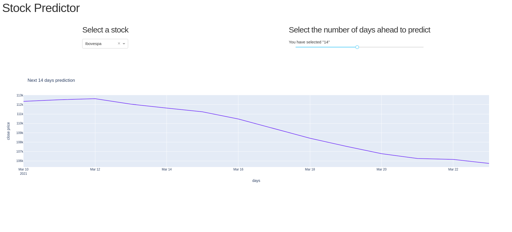

# Stock-Predictor-Udacity-capstone
Stock close price predictor for data science Udacity nanodegree 


## About

Investment firms, hedge funds and even individuals have been using financial models to better understand market behavior and make profitable investments and trades. A wealth of information is available in the form of historical stock prices and company performance data, suitable for machine learning algorithms to process.

This project is a web app stock price predictor that takes daily trading data as input and outputs projected close price estimates for given number of days ahead.

Manage to predict future stock close is a efficient tool in order to safely allocate or reach high incomes. Once we have lots of stock data and computation power to apply a Deep Learning model to this problem. Lets build a deep model able to predict the next values based on the knowledge in history




## Install 

```
pip install -r requirements
```

```
python src/app.py
```


## Project Structure

```
"""

├── DataAndModelReport.html -> project report html
├── DataAndModelReport.ipynb -> project report notebook
├── README.md 
└── src
    ├── app.py # flask application
    └── model.py # here trains the model and returns predictions

###### """
```

